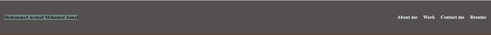
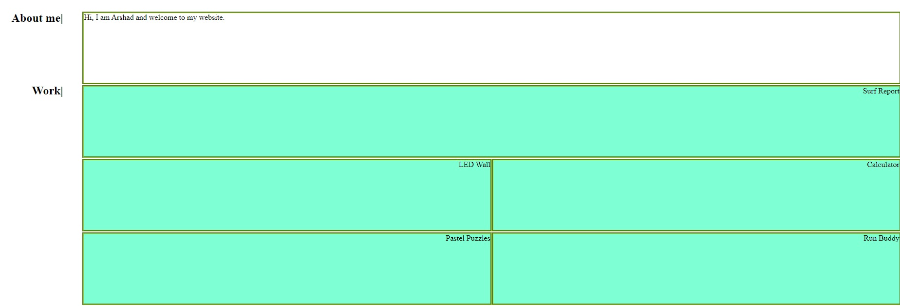
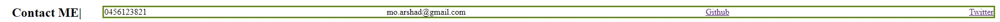

# MyPortfolio
Arshad's Portfolio

 * I have created my portfolio and the details are as follows
 * The head of the website is created and the "title" is given as "Arshad's Portfolio"
 *  Inside the body I have created a "header" tag with a class "header"
 * Created a H2 tag with my name and the links.
 
 

 * A nav with an id Seperator is created to seperate the header tag and main tag
 * The "main" tag is created, inside which i have placed "aside" tag and a "section" tag. Main is displayed as flex and the aside tag has 30% flex and the section tag has the other 70% flex.
* About me and Work section is defined inside the "main" tag.

* Contact me is defined inside the "footer" tag

* Please click the link (https://moarshad100.github.io/MyPortfolio/) for my published website

### References:
* I have referred my class activities for my website.
